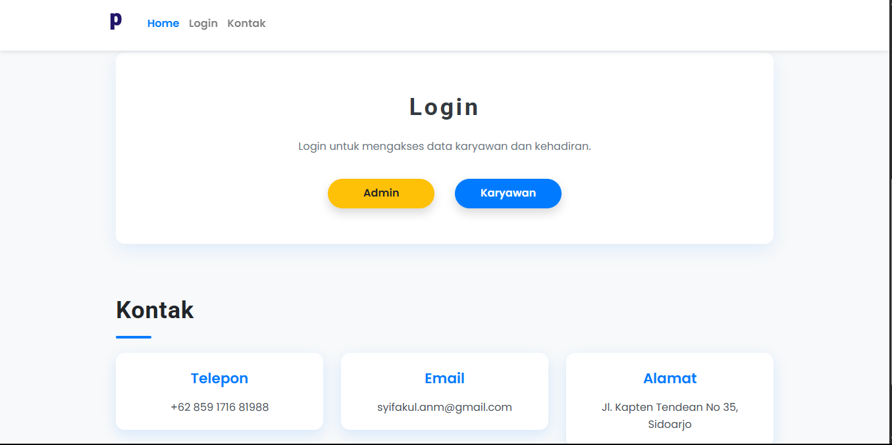
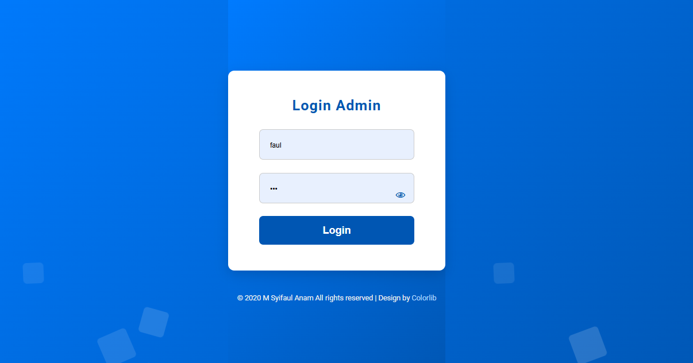
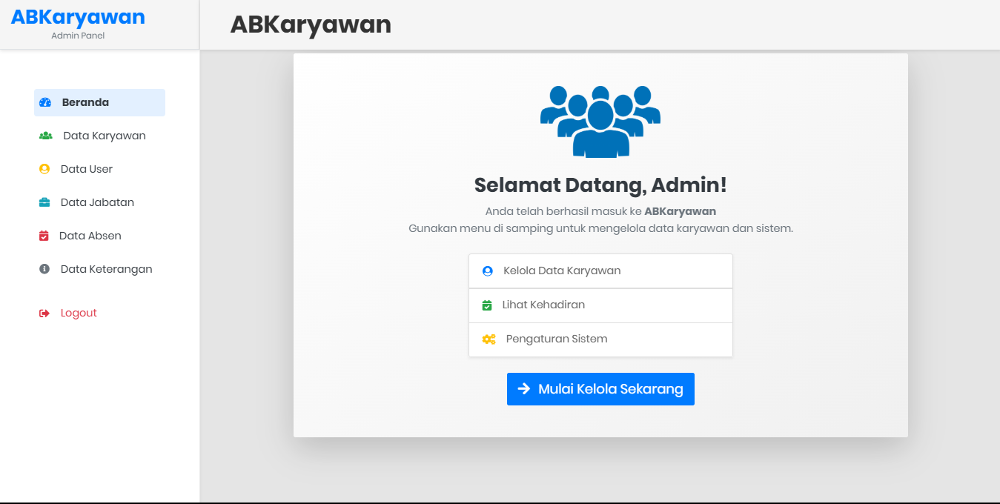
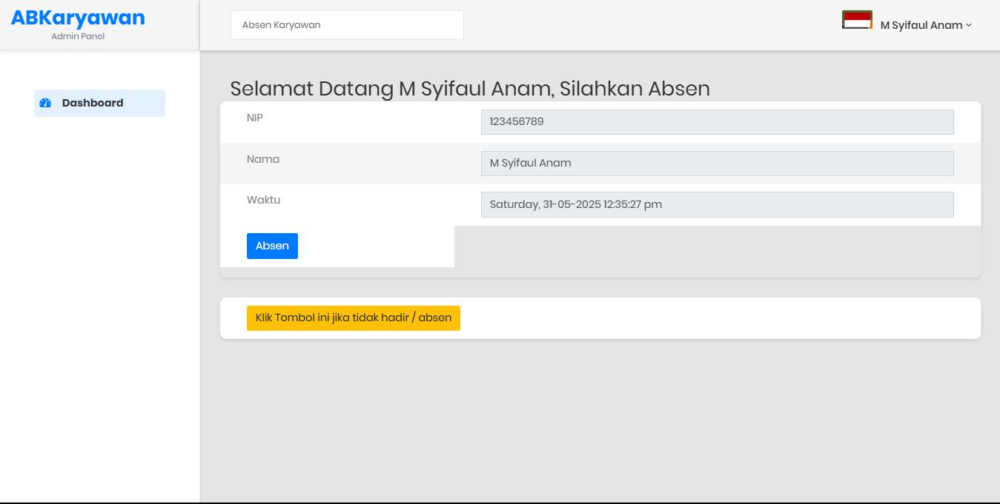

<p align="center">
  
    
</p>
<p align="center">
  
    
</p>


# AbsenSIKaryawan
Absensi dan Sistem Informasi Karyawan berbasis web


-> Absen Karyawan - SIKaryawan

Absen Karyawan - Sistem informasi karyawan merupakan aplikasi absensi berbasis web, yang dibuat untuk memenuhi kebutuhan perusahaan atau instansi yang membutuhkan aplikasi absensi karyawan.

-> Fitur - fitur aplikasi : 
1.admin, dimana admin bisa mengontrol aplikasi, ini seperti menambahkan, melihat, mengubah atau menghapus data.

2.Sistem absensi karyawan, sistem ini memungkinkan setiap karyawan melakukan absensi berdasarkan sesi nya masing - masing.  Untuk mencegah penyalahgunaan data.

-> Login default admin : 
  1. username = admin
  2. password = admin
  
-> Login default karyawan : 
  1. username = user
  2. password = user
  
# 🕒 APK-WEB-ABSENSI — Aplikasi Web Absensi Siswa

**APK-WEB-ABSENSI** adalah aplikasi web sederhana yang dirancang untuk mencatat dan mengelola kehadiran siswa. Dibuat dengan teknologi berbasis web (HTML, CSS, JS) dan dapat dikembangkan lebih lanjut menggunakan database dan backend PHP/MySQL. Cocok untuk sekolah, kampus, pelatihan, dan organisasi.

🌐 **[Live Demo](https://faulnam.github.io/APK-WEB-ABSENSI/)** *(aktifkan GitHub Pages jika belum)*  
📁 **[Lihat Repositori GitHub](https://github.com/faulnam/APK-WEB-ABSENSI)**


---

## ✨ Fitur Unggulan

- ✅ Form absensi harian siswa (nama, waktu, keterangan)
- 📄 Rekap data absensi dalam bentuk tabel
- 🔍 Pencarian data absensi dengan JavaScript
- 📱 Desain responsif di HP/laptop
- ⚙️ Mudah dikembangkan menjadi sistem database dinamis

---

## 🛠️ Teknologi Digunakan

- HTML5
- CSS3
- JavaScript
- (Optional untuk pengembangan lanjutan: PHP, MySQL)

---

## 🚀 Cara Menjalankan Proyek Secara Lokal

### 1. Clone Repositori

```bash
git clone https://github.com/faulnam/APK-WEB-ABSENSI.git

